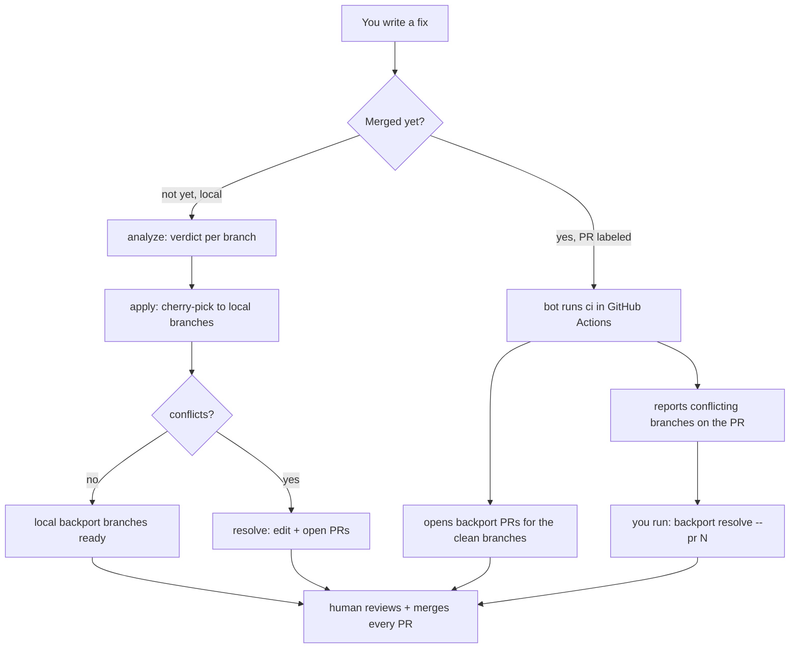
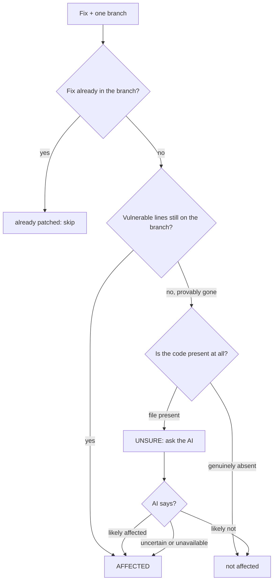

# AWS-LC Backport Bot

## Overview

AWS-LC maintains several long-lived **FIPS release branches** (`fips-2021-10-20`,
`fips-2022-11-02`, … `fips-2025-09-12-lts`, `NetOS`) alongside `main`. When a
security or correctness fix lands, it usually needs to be **backported** to every
older branch that still carries the vulnerable code — but not to branches that
never had it or already got the fix. Deciding that by hand is slow and easy to get
wrong.

This tool answers the question **"which release branches does this fix belong
on?"** and then does the mechanical backporting for you, while keeping a human in
the loop for anything risky. It works in two modes:

- **Local, pre-merge** (you drive): analyze a fix, cherry-pick it onto local
  branches, and interactively resolve conflicts. Because it works from a **patch**
  (a `git diff` / `git format-patch`) it can assess an **embargoed** fix *before*
  any public commit.
- **Automated, post-merge** (GitHub Actions drives): when a labeled PR merges, the
  bot analyzes it and opens a backport PR for every affected branch.

Two rules never bend:

1. **Nothing auto-merges, and the bot never touches upstream `aws/aws-lc`.** Every
   backport is a normal PR on a fork that a human must review and merge.
2. **No silent misses.** If the deterministic checks and the AI advisory can't
   confirm a branch is safe, it is flagged **AFFECTED for review** — never quietly
   dropped.

## Table of Contents

- [How it works](#how-it-works)
- [How a branch verdict is decided](#how-a-branch-verdict-is-decided)
- [Quick start](#quick-start)
- [Commands](#commands)
  - [`analyze` — which branches are affected?](#analyze--which-branches-are-affected)
  - [`apply` — cherry-pick onto local branches](#apply--cherry-pick-onto-local-branches)
  - [`resolve` — fix conflicts and open PRs](#resolve--fix-conflicts-and-open-prs)
  - [`ci` — post-merge automation](#ci--post-merge-automation)
  - [`clear`](#clear)
- [Configuration](#configuration)
- [Files](#files)
- [Testing](#testing)

## How it works

There are two entry points into the same engine. Locally you go
`analyze → apply → resolve`; in CI the bot runs `ci`, and you finish any conflicts
with `resolve`.



Under the hood the fix is always collapsed into **one synthetic commit** (its net
diff) before analysis, so the verdict is the same whether the work was one commit,
many commits, or uncommitted edits.

## How a branch verdict is decided

Everything else rests on this one step: given a fix and a single branch, what
verdict does it get? The engine (`engine.py`) decides deterministically first, and
only asks the AI (`ai.py`) when git history alone is inconclusive.



The bias is deliberate: the only confident **not affected** is "the vulnerable code
is genuinely not here." Anything ambiguous escalates toward **AFFECTED for review**,
so the tool may occasionally over-flag but never silently misses a real backport.

## Quick start

Run from **inside your AWS-LC checkout** (the tool defaults to the current
directory). The checkout needs the release branches fetched
(`git fetch origin`, giving `origin/fips-*`, `origin/NetOS`, `origin/main`).

```bash
cd <aws-lc>

# 1. Which branches need this fix?  (verdict table per branch)
backport analyze --commit <sha>

# 2. Cherry-pick it onto local backport branches (nothing is pushed)
backport apply --all-affected

# 3. Resolve any conflicts interactively, then open one PR per branch
backport resolve --pr <number>          # or --commit <sha>
```

`backport` is a thin wrapper; `python3 src/main.py <cmd>` is equivalent. Point at a
different checkout with `--repo <path>` (or `$BACKPORT_REPO_PATH`) if you're not
standing in one.

## Commands

### `analyze` — which branches are affected?

Gives **every** supported branch a definite verdict — **AFFECTED / not affected /
already patched** — and saves the run so `apply` can reuse it.

```bash
backport analyze --commit <sha>     # from an existing commit (base defaults to <sha>^)
backport analyze fix.patch          # from a git diff / format-patch file
backport analyze                    # from your uncommitted changes (git diff HEAD)
```

**Fixes spread across several commits** are handled three ways, all collapsed to
the fix's net change before analysis:

- **Uncommitted edits** — `analyze` with no argument diffs `git diff HEAD`.
- **A commit range** — `--commit A..B`, or `A...B` (e.g.
  `--commit origin/main...HEAD` for "everything on my branch").
- **A single commit / patch file** — `--commit <sha>` or a patch path.

The deterministic check (ancestry + patch-id + vulnerable pre-image + file
presence) decides the clear branches; the rest go to the AI advisory. `--no-ai`
runs deterministic-only, flagging every inconclusive branch AFFECTED for review.
Add `--json` for machine-readable output.

### `apply` — cherry-pick onto local branches

Cherry-picks the fix onto local `backport/<branch>/<id>` branches for review.
**Nothing is pushed, merged, or turned into a PR.**

```bash
backport apply --all-affected              # every AFFECTED branch from the last analyze
backport apply --branches fips-2022-11-02  # specific branches
```

Each pick is one of three outcomes:

- **Clean** — lands on `backport/<branch>/<id>`.
- **Test-only conflict** — if only a test/generated file clashes, the branch keeps
  its own tests, the source fix applies, and it still counts as clean.
- **Real conflict** — the pick is aborted (nothing left behind). If you're in a
  terminal, `apply` rolls straight into `resolve` for the conflicting branches (no
  re-analysis); otherwise it reports them for you to resolve later.

### `resolve` — fix conflicts and open PRs

The interactive fixer for branches that conflict. The common case is one command:

```bash
cd <aws-lc>
backport resolve --pr <number>      # that's it
```

It reads the backport bot's plan from the PR (see [`ci`](#ci--post-merge-automation)),
so it targets exactly the branches that conflicted **without re-analyzing** — which
is why **no AI is needed here**. For each conflicting branch it checks the branch
out (detached) in your working repo with the conflict live, so your open editor
shows it. You fix the files and `exit`; anything still holding `<<<<<<<` markers is
reported so you can re-enter. When done it asks before pushing, then opens **one
normal (non-draft) PR per resolved branch** and updates the summary comment on the
source PR.

Sensible defaults mean you rarely type flags:

| Default behavior | Flag to change it |
|---|---|
| Reads the PR plan; **no AI** | `--reanalyze` recomputes locally; `--ai` adds the AI advisory |
| Edits **in your current checkout** | `--worktree` uses an isolated throwaway worktree |
| Operates on the **current directory** | `--repo <path>` targets another checkout |

`git rerere` is enabled, so once you resolve a conflict it is auto-applied to any
**identical** conflict on a sibling branch (e.g. the FIPS twins) — you just verify.
`resolve` is interactive (run it in a terminal) and, like `ci`, targets a fork only.

### `ci` — post-merge automation

The automated counterpart, run by GitHub Actions. Given a **merged** commit it
analyzes every branch and opens a backport PR for each AFFECTED one.

```bash
backport ci --commit <merged-sha> --pr <source-pr-number>
backport ci --commit <merged-sha> --dry-run   # analyze + cherry-pick, no push/PR
```

Per branch: a clean cherry-pick (or a test-only conflict) becomes a **normal PR**
into the release branch (never auto-merged); a **real conflict** is only
**reported**. It then posts a summary comment on the source PR containing:

- a **human-readable table** of every branch and its outcome, and
- a collapsed **machine-readable `json` plan** (tagged `backport_bot_plan`) that
  `resolve` reads back to fix the conflicting branches.

`ci` **refuses to run against upstream `aws/aws-lc`** — it only pushes and opens
PRs on a fork (`--remote`, default `origin`).

**Wiring it up:** copy `backport-bot.yml` into the fork's `.github/workflows/`. It
triggers when a PR merges carrying the `needs-backport` label and uses a
`BEDROCK_ROLE_ARN` secret for the AI layer. Without the secret the tool still runs
deterministically and flags anything it cannot confirm as AFFECTED.

### `clear`

Removes the saved run state (`.backport-runs/`) from the tool folder.

```bash
backport clear
```

## Configuration

**Pointing at a repo.** In order of precedence: `--repo <path>`, then
`$BACKPORT_REPO_PATH`, then the current working directory.

**AI layer (Amazon Bedrock).** The advisory layer uses Bedrock via the `anthropic`
SDK and the boto3 default credential chain. If the SDK or credentials are
unavailable, the AI path is skipped and the deterministic engine runs alone.
`BACKPORT_DISABLE_AI=1` forces it off. The model pin and call knobs live in one
place — **`model-config.json`** at the tool root, loaded by `src/settings.py`. To
change the model, edit that file; environment variables override it per run.

**Environment variables:**

| Name | Purpose |
|---|---|
| `BACKPORT_REPO_PATH` | Default AWS-LC checkout (else `--repo`, else cwd). |
| `AWS_LC_REPO` | Repo used by the replay test harness. |
| `BACKPORT_VERSIONS_MANIFEST` | FIPS branch manifest path (default `fips_versions.json`). |
| `BACKPORT_BRANCH_PREFIXES` | Supported-branch prefixes when no manifest is present. |
| `BACKPORT_MAINLINE_REF` | Mainline ref (default `origin/main`). |
| `BACKPORT_GENERATED_PATHS` | Generated-file prefixes excluded from patch-id matching (default `generated-src`). |
| `BEDROCK_MODEL_ID` | Override the model pinned in `model-config.json`. |
| `AWS_REGION`, `BEDROCK_MAX_TOKENS` | Override the region / token cap from `model-config.json`. |
| `BACKPORT_DISABLE_AI` | `1` forces the deterministic-only path. |

## Files

Each module has one job; see `CLAUDE.md` for the architecture and the rationale
behind each analysis path.

```
awslc-backport/
  backport           Wrapper script (bridges AWS_REGION, runs src/main.py).
  backport-bot.yml   Reference GitHub Actions workflow (copy into .github/workflows/).
  model-config.json  AI model config (model id, region, max tokens, byte caps).
  requirements.txt   Runtime deps for the AI layer (anthropic, boto3).
  README.md          This file.
  CLAUDE.md          Architecture / maintainer notes.
  src/
    main.py       Entrypoint: argument parser + subcommand dispatch.
    analyze.py    The `analyze` command.
    apply.py      The `apply` and `clear` commands.
    ci.py         The `ci` command (post-merge PR automation).
    resolve.py    The `resolve` command (interactive local conflict fixing).
    verdicts.py   Deterministic bucketing + the advisory AI passes.
    engine.py     Deterministic core: branch resolution, impact analysis
                  (is_branch_affected, vulnerable_preimage_present), git helpers.
    ai.py         Advisory AI auditor / tie-breaker (never changes a verdict alone).
    gitutil.py    Git plumbing, throwaway worktrees, cherry-pick, repo targeting.
    patches.py    Patch -> temp commit, patch-source resolution, test-file prompt.
    runstate.py   The analyze -> apply run-state cache.
    render.py     The analyze table / JSON output.
    settings.py   Loads model-config.json (single home for the model pin).
    common.py     Shared verdict constants + the BackportError type.
  testing/
    test_engine.py            Fast unit tests for the pure engine helpers.
    test_plan_roundtrip.py    Locks the ci -> resolve PR-plan hand-off.
    replay_real_cve.py        Real replays: roll a sandbox back to before a fix
                              and grade the engine against what the team shipped.
    reliable_cves.txt         Curated, hand-verified test bench.
    answer_key.txt            Per-fix hand-verified AFFECTED branch sets.
    fips_versions.aws-lc.json Support-window manifest (from VERSIONING.md).
```

## Testing

```bash
# Unit tests (no repo, credentials, or network) -- runs every testing/test_*.py:
python3 -m unittest discover -s testing -p 'test_*.py'
#   test_engine.py          pure engine helpers (whitespace/comment/date logic)
#   test_plan_roundtrip.py  the ci -> resolve PR-plan hand-off contract

# Real replays (needs a local aws-lc clone; set AWS_LC_REPO or pass --repo).
# Rolls a throwaway sandbox back to before each fix and grades the engine
# against what the team actually shipped:
python3 testing/replay_real_cve.py --file testing/reliable_cves.txt \
    --answers testing/answer_key.txt --no-ai
python3 testing/replay_real_cve.py 3107 --no-ai      # a single fix
```
